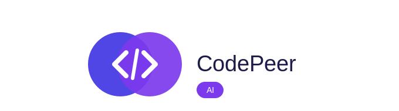
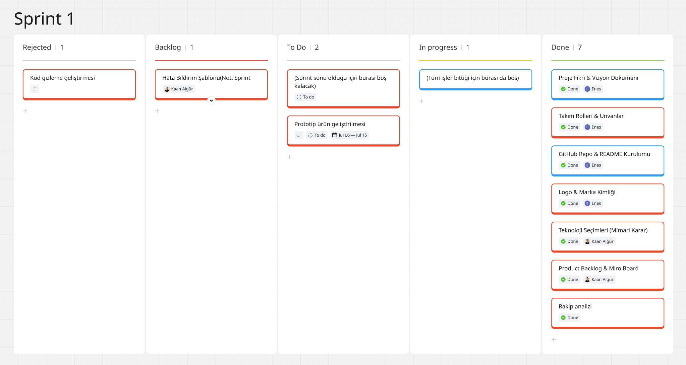
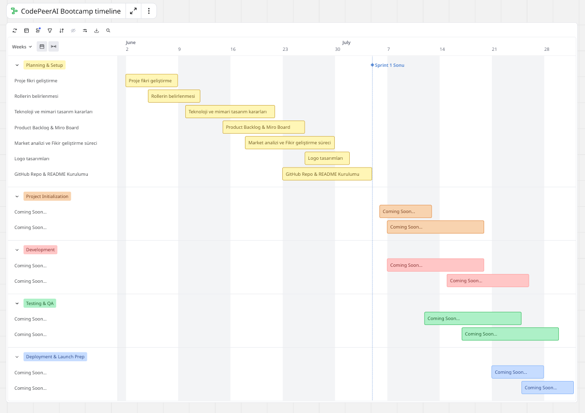
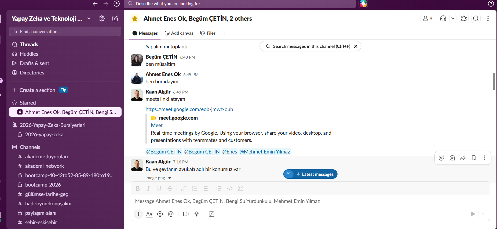
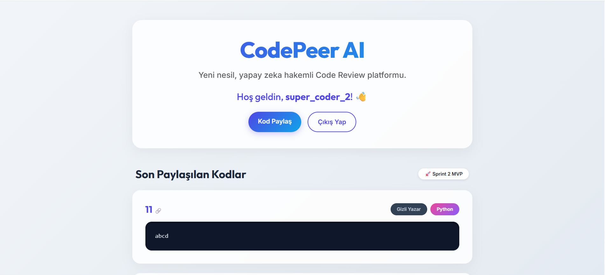
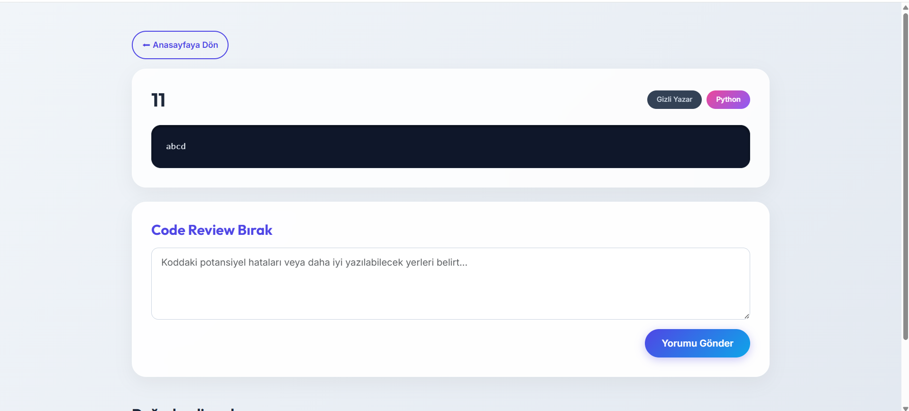

# CodePeer AI

  

## Takım İsmi
**CodePeer AI Team**

## Takım Rolleri

| İsim | Unvan | LinkedIn |
|------|--------|----------|
| Ahmet Enes Ok | Scrum Master & Developer |  |
| Kaan Algür | Product Owner & Developer |  |
| Begüm Çetin | Business Analyst |  |
| Bengi Su Yurdunkulu | Process & QA Analyst |  |   
| Mehmet Emin Yılmaz | QA Tester / Technical Writer | |
## Ürün İsmi
**CodePeer AI**

## Ürün Açıklaması
CodePeer AI, junior seviyesindeki yazılım geliştiricilerin başkasının yazdığı kodu okuma, anlama ve mimari olarak eleştirme (Code Review) yeteneğini geliştirmeyi hedefleyen bir eğitim simülasyon platformudur.

Büyük projelerdeki kodu okuyup Clean Code prensiplerine göre denetleyebilmek, performans darboğazlarını fark edebilmek deneyim gerektiren bir yetkinliktir. Mevcut yapay zeka araçları (Copilot, ChatGPT vb.) genellikle kodu doğrudan düzelterek bu öğrenme sürecini kısaltmaktadır.

CodePeer AI, yapay zekayı kod yazan değil, gerçek dünyadaki Pull Request süreçlerini simüle ederek code review sürecini denetleyen bir hakem (Mediator) olarak konumlandırır. Amacımız, geliştiricilere kod yazma becerisinin yanı sıra kod inceleme ve mimari bakış açısı kazandırmaktır.

## Ürün Özellikleri

**AI Mediator (Yapay Zeka Hakemliği):**
Kullanıcı bir kodu inceleyip review yorumu bıraktığında, yapay zeka bu yorumu değerlendirir. Tespitin doğruluğunu, önerilen çözümün sağlamlığını analiz eder ve geliştiriciye geri bildirim verir. Böylece sadece kod yazan değil, kodu inceleyen kişi de eğitilmiş olur.

**Bug Seeding (Kasıtlı Hata Enjeksiyonu):**
Bir kullanıcının gönderdiği temiz kodun bir kopyasına, yapay zeka aracılığıyla kasıtlı olarak gizli hatalar (Clean Code ihlalleri, N+1 problemleri vb.) enjekte edilir. Bu hatalı kopya, platform üzerinden başka bir kullanıcıya review yapması için atanır. İnceleyen kişi hem gerçek bir meslektaşının kod yazma tarzını görür hem de bilinçli olarak yerleştirilmiş hataları tespit ederek kod inceleme pratiği yapar. Bu sayede kullanıcılar birbirlerinin kodları üzerinden karşılıklı olarak gelişir; hem kod yazan kişi kendi kodunun nasıl bir "hatalı versiyonda" değerlendirildiğini görüp geri bildirim alır, hem de inceleyen kişi review yeteneğini güçlendirir.

**Double-Blind Review (Çift Kör İnceleme):**
Kimin kodunun incelendiği ve kimin incelediği karşılıklı olarak gizli tutulur. Bu sayede kişisel önyargılar ve arkadaşlık ilişkileri değerlendirme kalitesini etkilemez.

**Reviewer Kalite Puanlaması (Gamification):**
Yapay zeka, yapılan review'ların kalitesine göre kullanıcılara puan verir. Yüzeysel yorumlar ("güzel olmuş" gibi) ile mimari bir hata tespit eden yorumlar birbirinden ayrıştırılır.

## Hedef Kitle
- Junior seviyedeki yazılım geliştiriciler ve bootcamp/kodlama okulu mezunları
- Teknik mülakat ve işe alım süreçlerine hazırlanan adaylar
- Junior'dan mid seviyeye geçiş yapmaya çalışan geliştiriciler
- Kod inceleme (code review) kültürünü kurumsallaştırmak isteyen küçük/orta ölçekli yazılım ekipleri
- Kendi mentorluk/eğitim programlarında pratik PR süreçleri simüle etmek isteyen bootcamp ve eğitim kurumları

## Product Backlog
[Backlog Link for our Miro Page](https://miro.com/app/board/uXjVH-iNY0g=/?share_link_id=451167648398)

## Sprint-1

  

  

## Sprint 1 (19 Haziran - 5 Temmuz 2026): Planlama ve Altyapı

Sprint 1 kapsamında kod geliştirmeye başlamadan önce, projenin sağlam bir temel üzerine kurulması için gerekli planlama ve altyapı çalışmaları tamamlandı.

| Kart | Açıklama | Puan |
|---|---|---|
| Proje fikri & vizyon dokümanı | AI-Peer → CodePeer AI vizyon dokümanının yazılması, problem tanımı | 2 |
| Takım rolleri belirleme | Kim hangi görevi üstlenecek, unvanların netleştirilmesi | 1 |
| GitHub repo kurulumu | Repo açma, README şablonunun doldurulması | 1 |
| Logo & marka kimliği | CodePeer AI logosunun tasarlanması | 2 |
| Teknoloji seçimleri | Next.js, Supabase, Groq, Vercel, Monaco Editor kararı | 2 |
| Hedef kitle & özellik analizi | Ürün özelliklerinin ve hedef kitlenin dokümante edilmesi | 3 |
| Product Backlog oluşturma | Miro board kurulumu, backlog kartlarının yazılması | 2 |
| Rakip analizi | Mevcut code review süreçlerinin ve AI destekli geliştirici araçlarının incelenmesi | 2 |
| **Sprint 1 Toplamı** | | **15** |

Sprint 1, projenin kod yazılmadan önceki temelini oluşturduğu için doğası gereği düşük-orta puanlı işlerden oluşuyor; bu sprintte asıl amaç hız değil, doğru kararların (vizyon, teknoloji, hedef kitle) sağlam şekilde atılmasıydı. Toplam proje puanının **100** olduğu varsayımıyla Sprint 1'e **15 puan** karşılık geliyor ve bu puanın tamamı tamamlanmış durumda. Geriye kalan **85 puan**, Sprint 2'de kurulacak çalışan iskelet (35 puan) ve Sprint 3'te eklenecek yapay zeka katmanı ile sunum hazırlıklarına (50 puan) dağılmış durumda.

## Hikaye Puanı (Story Point) Sistemi

Proje ilerlemesini somut ve ölçülebilir şekilde takip edebilmek için tüm projeye toplam **100 puanlık** bir hikaye puanı bütçesi belirledik ve bu bütçeyi, backlog'daki her kartın karmaşıklığına göre 3 sprint arasında dağıttık. Basit/rutin işler düşük puan (1-3), belirsizlik veya efor gerektiren işler yüksek puan (5-10 arası) almıştır.

Sprint 1'e bu bütçeden **15 puan** ayrılmıştı çünkü bu sprintte henüz kod yazılmıyor, projenin karar aşaması (vizyon, teknoloji seçimi, hedef kitle, backlog) tamamlanıyordu — bu tür işler doğası gereği Sprint 2 ve 3'teki geliştirme işlerine kıyasla daha az karmaşıktır. Sprint 1 sonunda planlanan 15 puanın tamamı tamamlanmış, yani bu sprint **%100 hedefe ulaşarak** kapanmıştır.

| Sprint | Planlanan Puan | Tamamlanan Puan | Durum |
|---|---|---|---|
| Sprint 1 (19 Haziran - 5 Temmuz) | 15 | 15 | ✅ Tamamlandı |
| Sprint 2 (6 - 19 Temmuz) | 35 | — | 🔄 Devam Ediyor |
| Sprint 3 (20 Temmuz - 2 Ağustos) | 50 | — | ⏳ Planlandı |
| **Toplam Proje Puanı** | **100** | **15 / 100 (%15)** | |

*Not: Sprint 3'teki "Bug Seeding" özelliği stretch (koşullu) bir hedef olarak işaretlenmiştir; süre yetişmezse toplam puana dahil edilmeden README'nin "Gelecek Vizyonu" bölümünde belirtilecektir.*

### 🗓️ Daily Scrum Sürecimiz
Ekip içi iletişimimizi ve günlük durum değerlendirmelerimizi **Slack** üzerinden yürüttük. Her gün ekip üyeleri "Dün ne yaptım?", "Bugün ne yapacağım?" ve "Önümde bir engel var mı?" formatında güncellemelerini Slack kanalımızda paylaşarak senkronize kaldı. 

  

### 🚀 Ürün Geliştirme Durumu
Sprint 1 tamamen altyapı, mimari kararlar ve tasarım üzerine kurulduğu için henüz kodlama aşamasına geçilmemiştir. Ancak ürünümüzün görsel kimliğini oluşturacak ilk çıktımız olan marka logomuz tasarlanmış ve proje klasör yapımız GitHub üzerinde ayağa kaldırılmıştır.

  

### 🔍 Sprint Review (Sprint İncelemesi)
**Bu sprintte neler başardık ve nelere karar verdik?**
- Ürünün temel problemi ve vizyonu netleştirildi (AI tabanlı Code Review hakemliği).
- Kanban board'umuz (Product Backlog) Miro üzerinde oluşturuldu ve görev dağılımları tamamlandı.
- Sprint 1 için planlanan tüm idari ve mimari kararlar firesiz alınarak %100 başarı oranına ulaşıldı.

### ♻️ Sprint Retrospective (Sprint Değerlendirmesi)
**Neyi iyi yaptık?**
- Ekip içi iletişim ve görev paylaşımı (Scrum Master, PO, BA, QA) çok hızlı ve sorunsuz oturdu.
- Teknoloji seçimi konusunda ortak karara hızlı varıldı.

**Neyi iyileştirmemiz gerekiyor?**
- Toplantı saatlerinin (Daily) herkesin takvimine daha uygun bir sabit saate çekilmesi gerekiyor.
- Sprint 2'deki teknik görevlerin efor tahminlemelerini yaparken potansiyel riskleri daha detaylı konuşmalıyız.

**Gelecek Sprint (Sprint 2) İçin Aksiyon Planı:**
- Kodlamaya aktif olarak başlanacak.
- Temel iskeletin ayağa kaldırılmasına odaklanılacak.

## Sprint 2 (6 Temmuz - 19 Temmuz 2026): MVP (Minimum Viable Product)

Sprint 2 kapsamında ürünümüzün çalışan ilk versiyonunu (MVP) başarıyla ayağa kaldırdık. Yapay Zeka (AI) entegrasyonu dışındaki tüm temel fonksiyonlar ve arayüz tamamlandı.

| Kart | Açıklama | Durum |
|---|---|---|
| Auth Sistemi (Login/Register) | Çerez tabanlı ve şifrelemeli kullanıcı giriş sistemi | ✅ Tamamlandı |
| Veritabanı Altyapısı | FastAPI & SQLite ile tablo ilişkilerinin kurulması | ✅ Tamamlandı |
| Şık ve Modern Arayüz (UI) | Glassmorphism, modern fontlar ve premium görünüm entegrasyonu | ✅ Tamamlandı |
| Post Detay ve Review Ekranı | Kullanıcıların kod detayına inip değerlendirme yorumu bırakabilmesi | ✅ Tamamlandı |
| Çift-Kör (Double-Blind) Gizlilik | Yazar ve İnceleyen kimliklerinin DB ve arayüz seviyesinde gizlenmesi | ✅ Tamamlandı |

### 🚀 Sprint 2 Çıktıları ve Geliştirmeler
- **Gizlilik Mantığı (Privacy):** Anasayfadaki kodların ziyaretçilerden gizlenmesi ve veritabanı sorgularının giriş yapanlara özel kısıtlanması sağlandı.
- **Premium UI/UX:** Sıradan Bootstrap tasarımından çıkılarak, havaya kalkan butonlar, blur (bulanık) arka planlı cam efektli kartlar ve koyu mod (dark mode) kod blokları eklendi.
- **Gerçek Code Review Akışı:** Kullanıcıların tıklayıp detayları görebileceği ve "Review" bırakabileceği sistem kodlandı. İsimler (Sen hariç) "Gizli Yazar" veya "CodePeer #1" olarak anonimleştirildi.

  

  

## Sprint-3
Gelecek günlerde bu sprint için detaylı eklemeleri yapacağım.
